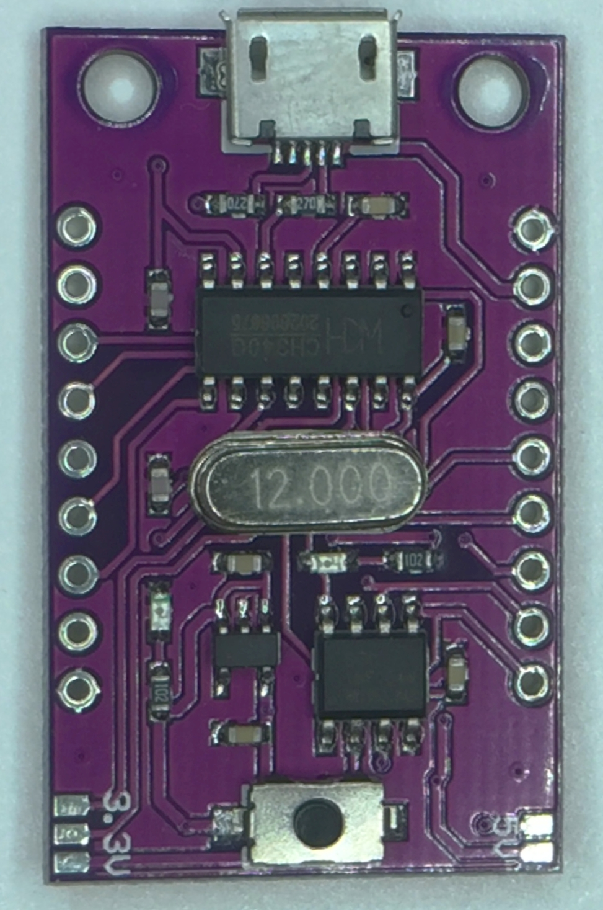
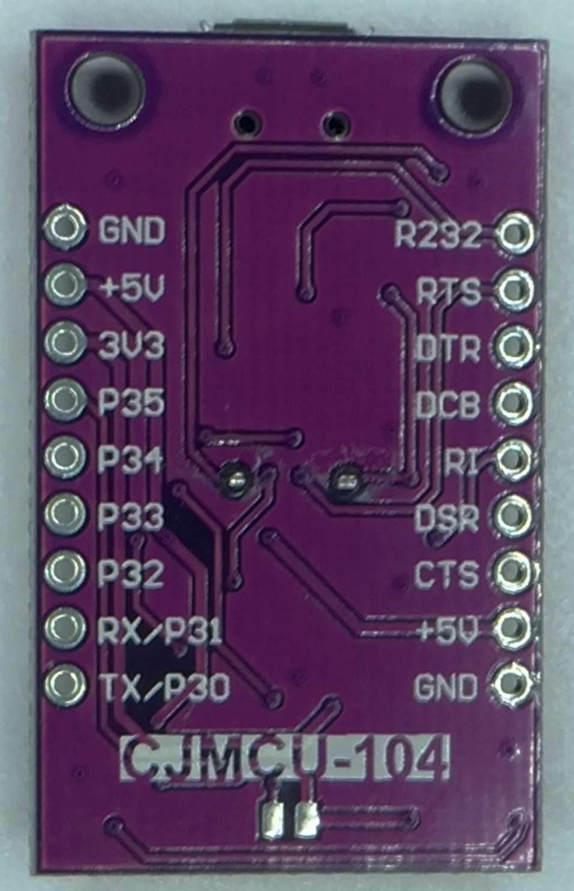

# Programmable-MCU-STC15F104W-Development-Board

This board consists of a STC15W104W microcontroller and a CH340G USB interface. 
Print is marked: CJMCU-104 found on ebay, ali-express etc
This repository holds:
- The reverse-engineered schematic.
- A tiny demo project.

# Preparation:
Needs a drop of solder to connect all solder islands in the corner of the pcb either on the 5V or 3.3V before using it. 

# Software requirements:
- SDCC (free to use compiler w/o any limits like keil)
- AtmelStudio 7 (not needed, but has C beautyfier, editor, make, etc...)
- stc-isp-15xx-v6.87K.exe (to program the STC processor)

# Links:
SDCC    http://sdcc.sourceforge.net/
Programmer  http://www.stcmicro.com/rjxz.html

